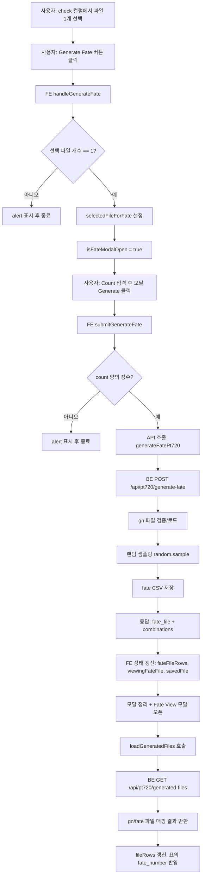

# Generate Fate 기능 분석 (pt720)

## 범위
- 기준 화면: fsWeb/src/screens/pt720/Menu9GenerateCombinations.tsx
- 분석 대상: Generate Fate 버튼 클릭부터 Fate 결과 표시/파일목록 갱신까지
- 포함: 프론트엔드 + 백엔드 호출 순서, 읽기/쓰기 파일 경로, 호출 함수명

## 프로그램 흐름도

## 호출 순서 (프론트엔드)
1. 파일: fsWeb/src/screens/pt720/Menu9GenerateCombinations.tsx
   함수: handleGenerateFate()
   역할:
   - checkedRows에서 체크된 행 인덱스 추출
   - 1개가 아니면 alert 후 종료
   - selectedFileForFate에 fileRows[idx].file_name 저장
   - fateCount 기본값 5 설정
   - isFateModalOpen을 true로 변경

2. 파일: fsWeb/src/screens/pt720/Menu9GenerateCombinations.tsx
   함수: submitGenerateFate()
   역할:
   - fateCount를 Number로 변환
   - 양의 정수 검증 실패 시 alert 후 종료
   - runTask 내부에서 API generateFatePt720(selectedFileForFate, count) 호출
   - 응답 res 기준 상태 업데이트:
     - setFateFileRows(res.combinations)
     - setViewingFateFile(res.fate_file)
     - setSavedFile(res.fate_file)
     - setLastResponse(res)
     - setMessage("Generated ... Fate numbers...")
   - 모달 상태 정리:
     - setIsFateModalOpen(false)
     - setFateCount("")
     - setSelectedFileForFate("")
     - setIsFateViewModalOpen(true)
   - 마지막에 loadGeneratedFiles() 호출

3. 파일: fsWeb/src/api/client.ts
   함수: generateFatePt720(fileName, count)
   역할:
   - POST /api/pt720/generate-fate
   - body: { file_name, count }
   - 응답 타입: { fate_file, combinations }

4. 파일: fsWeb/src/screens/pt720/Menu9GenerateCombinations.tsx
   함수: loadGeneratedFiles()
   역할:
   - getGeneratedFilesPt720() 호출
   - fileRows 갱신

5. 파일: fsWeb/src/api/client.ts
   함수: getGeneratedFilesPt720()
   역할:
   - GET /api/pt720/generated-files
   - 응답 rows를 표 데이터로 사용

## 호출 순서 (백엔드)
1. 파일: pt720/src/server.py
   함수: generate_fate(req: GenerateFateRequest)
   라우트: POST /api/pt720/generate-fate
   순서:
   - _validate_gn_filename(req.file_name)
   - 입력 파일 경로 구성: DB_GN_PATH / name
   - 파일 존재 확인
   - CSV 읽기 (Group, No1..No6) -> combinations 배열 생성
   - combinations 비어있으면 422
   - req.count > len(combinations)면 422
   - random.sample(combinations, req.count)로 fate_combinations 생성
   - 타임스탬프 추출:
     - 원본 파일명이 generate_number_YYYYMMDD_HHMMSS.csv 패턴이면 해당 timestamp 재사용
     - 아니면 현재 시간으로 생성
   - fate_filename = fate_number_<timestamp>.csv
   - DB_FATE_PATH 디렉터리 생성
   - fate CSV 저장 (필드: No, Group, No1..No6)
   - 응답 반환: { fate_file, combinations }

2. 파일: pt720/src/server.py
   함수: list_generated_files()
   라우트: GET /api/pt720/generated-files
   순서:
   - DB_GN_PATH, DB_FATE_PATH 보장
   - gn 폴더의 CSV 파일 목록 조회(최신순)
   - 각 gn 파일의 timestamp로 fate_number_<timestamp>.csv 존재 여부 확인
   - rows에 { file_name, fate_file or None } 구성 후 반환

## 파일 I/O 요약
- 읽는 파일
  - pt720/db/gn/<선택된 generate 파일명>.csv
- 생성/쓰는 파일
  - pt720/db/fate/fate_number_<timestamp>.csv
- 목록 갱신 시 참조 폴더
  - pt720/db/gn
  - pt720/db/fate

## 관련 함수/파일 빠른 인덱스
- 프론트 화면
  - fsWeb/src/screens/pt720/Menu9GenerateCombinations.tsx
  - handleGenerateFate
  - submitGenerateFate
  - loadGeneratedFiles
- 프론트 API
  - fsWeb/src/api/client.ts
  - generateFatePt720
  - getGeneratedFilesPt720
- 백엔드
  - pt720/src/server.py
  - generate_fate
  - list_generated_files
  - _validate_gn_filename
- 백엔드 경로 상수
  - pt720/src/common.py
  - DB_GN_PATH
  - DB_FATE_PATH
